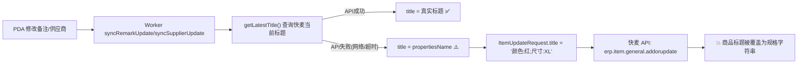

# title 覆盖风险深度审计 + 修复计划

两路并行代理深入追踪了备注更新和供应商更新的完整数据流，逐文件逐字段映射。

---

## 一、核心发现：title 可能被意外覆盖

### 问题链路



### 根因

[OrderSyncWorker.kt:L290-L303](file:///d:/trea项目/快麦取货通/app/src/main/java/com/kuaimai/pda/data/OrderSyncWorker.kt#L290-L303) — `getLatestTitle()`

```kotlin
private suspend fun getLatestTitle(..., fallback: String): String {
    try {
        val skuResp = kmApi.getSkuInfo(SkuQueryRequest(skuOuterId = skuOuterId))
        val itemOuterId = skuList.firstOrNull()?.itemOuterId ?: ""
        if (itemOuterId.isBlank()) return fallback        // ← 降级！title = propertiesName
        val itemResp = kmApi.getItemDetail(ItemGetRequest(outerId = itemOuterId))
        val title = itemResp.response?.item?.title ?: ""
        return title.ifBlank { fallback }                   // ← 降级！title = propertiesName
    } catch (e: Exception) {
        Log.w(TAG, "获取最新title失败，使用降级值: ${e.message}")
        return fallback                                     // ← 降级！title = propertiesName
    }
}
```

`fallback` 就是 `propertiesName`（如 `"颜色:红;尺寸:XL"`）。另外，v1.77 新增的 `enqueueRemarkUpdateDirect`/`enqueueSupplierUpdateDirect` 中用了 `safeProperties = propertiesName.ifBlank { "-" }`，此时 fallback 会是 `"-"`。

### 完整字段映射 — 快麦 API 收到的请求

| 字段 | 路径 | 值 | 风险 |
|------|------|-----|:--:|
| `id` | 商品系统ID | `sys_item_id` | 无 |
| `outerId` | 商家编码 | `skuOuterId.substringBefore("-")` | 无 |
| **`title`** | **商品标题** | **getLatestTitle() → fallback** | **🔴 高风险** |
| `skus[].id` | SKU系统ID | `sys_sku_id` | 无 |
| `skus[].outerId` | SKU商家编码 | `skuOuterId` | 无 |
| `skus[].propertiesName` | SKU规格 | `propertiesName` | ⚠️ 一并发送 |
| `skus[].remark` | SKU备注 | 用户输入 (仅备注更新) | ✅ 目标字段 |
| `skus[].suppliers[]` | 供应商列表 | 新供应商 (仅供应商更新) | ✅ 目标字段 |

**`erp.item.general.addorupdate`** 是全量更新 API(upsert 语义)。传入的所有字段都会写回商品记录。`title` 和 `propertiesName` 是必传字段，但降级时它们会被错误的值覆盖。

### title 覆盖攻击路径

| 条件 | fallback 值 | 快麦商品标题变成 |
|------|-----------|----------------|
| 网络正常 | 真实标题 ✅ | 不变 |
| getSkuInfo 超时 | `"颜色:红;尺寸:XL"` | `"颜色:红;尺寸:XL"` 💥 |
| getItemDetail 超时 | `"颜色:红;尺寸:XL"` | `"颜色:红;尺寸:XL"` 💥 |
| **独立扫码 + 网络故障 + propertiesName为空** | `"-"` | `"-"` 💥 |

**修复前 v1.76 也一直存在此风险**（getLatestTitle 设计如此），v1.77 的 `ifBlank{"-"}` 使独立扫码场景的 title 降级更糟糕。

---

## 二、其他字段安全性确认 ✅

| 字段 | 在 DTO 中？ | 是否被赋值？ | 结论 |
|------|:--:|:--:|:--:|
| barcode | 否 | — | 安全 |
| price | 否 | — | 安全 |
| costPrice | 否 | — | 安全 |
| stock | 否 | — | 安全 |
| itemCode | 否 | — | 安全 |
| itemName | 否 | — | 安全 |
| brand | 否 | — | 安全 |
| category | 否 | — | 安全 |

**仅 `title` / `propertiesName` / `remark` / `skuSuppliers` 四个字段被发送到快麦 API。没有其他隐藏字段。**

---

## 三、修复方案

### 修复 1（P0）：getLatestTitle 降级时拒绝同步，不发送错误 title

**逻辑**：如果无法获取真实 title，说明网络或 API 有问题，应重试而非冒风险发送错误数据。

```kotlin
// 修改 getLatestTitle — 失败时返回 null
private suspend fun getLatestTitle(kmApi: KuaimaiApiService, skuOuterId: String): String? {
    try {
        val skuResp = kmApi.getSkuInfo(SkuQueryRequest(skuOuterId = skuOuterId))
        val skuList = skuResp.response?.itemSku ?: emptyList()
        val itemOuterId = skuList.firstOrNull()?.itemOuterId ?: ""
        if (itemOuterId.isBlank()) return null              // ← 返回 null，不降级
        val itemResp = kmApi.getItemDetail(ItemGetRequest(outerId = itemOuterId))
        val title = itemResp.response?.item?.title ?: ""
        return title.ifBlank { null }                        // ← 返回 null，不降级
    } catch (e: Exception) {
        Log.w(TAG, "获取最新title失败: ${e.message}")
        return null                                          // ← 返回 null，不降级
    }
}

// 修改 syncRemarkUpdate — title 为 null 时拒绝执行
val title = getLatestTitle(kmApi, skuOuterId)
if (title == null) {
    Log.w(TAG, "无法获取商品标题，跳过备注同步: skuOuterId=$skuOuterId")
    return false  // Worker 会重试直到 title 可获取
}

// 修改 syncSupplierUpdate — 同上
val title = getLatestTitle(kmApi, skuOuterId)
if (title == null) {
    Log.w(TAG, "无法获取商品标题，跳过供应商同步: skuOuterId=$skuOuterId")
    return false
}
```

**效果**：
- 网络正常时：title = 真实标题，正常发送 ✅
- 网络故障时：title = null → 拒绝发送 → Worker 重试 → 网络恢复后正常发送 ✅
- 商品标题永不会被覆盖 ✅

### 修复 2（P1）：currentSkuDetail 旧值污染

[ProductViewModel.kt L120](file:///d:/trea项目/快麦取货通/app/src/main/java/com/kuaimai/pda/ui/product/ProductViewModel.kt#L120)

```kotlin
fun loadSkuInfo(skuOuterId: String) {
    viewModelScope.launch {
        _uiState.value = _uiState.value.copy(isLoading = true, error = null)
        currentSkuDetail = null       // ← 新增：防止旧值污染
        currentItem = null            // ← 新增：防止旧值污染
        try {
            ...
```

### 修复 3（P2）：去掉 `ifBlank` 包装，与 `updateRemarkWithQueue` 路径一致

[PickOrderRepository.kt L230+L242](file:///d:/trea项目/快麦取货通/app/src/main/java/com/kuaimai/pda/data/repository/PickOrderRepository.kt#L230)

`updateRemarkWithQueue` 路径中 payload 直接用 `item.propertiesName`，无 `ifBlank` 包装。去掉独立扫码路径的 `ifBlank` 保持两条路径一致：

```kotlin
// enqueueRemarkUpdateDirect — 直接使用 propertiesName
payload = """{"remark":"${...}","sys_sku_id":$sysSkuId,"sys_item_id":$sysItemId,"sku_outer_id":"${...}","properties_name":"${TimeUtils.escapeJson(propertiesName)}"}"""

// enqueueSupplierUpdateDirect — 同上
payload = """{"supplier_name":"${...}","supplier_code":"${...}","sys_item_id":$sysItemId,"sys_sku_id":$sysSkuId,"sku_outer_id":"${...}","properties_name":"${TimeUtils.escapeJson(propertiesName)}"}"""
```

---

## 四、安全验证报告（三路并行审计）

### ✅ 验证通过项

| 验证项 | 结论 |
|--------|:--:|
| `ItemUpdateRequest.title` 无需改类型 | **`String = ""` 正确** — 守卫 `if (title == null) return false` 保证 null 不传入 DTO；Gson 默认不序列化 null，若改为 `String?` 会导致 title 从 JSON 中消失→API 拒绝 |
| Worker 重试链路完整性 | **正确** — retryCount: 0→1→2→3→-1(冲突)→deleteById→队列清空。默认指数退避(30s/60s/120s)，无显式 BackoffCriteria 设置 |
| `currentSkuDetail=null` 位置 | **正确** — 放在 try 块开头是对的；放 finally 会破坏成功路径的赋值 |
| `confirmChangeSupplier` UI 更新独立性 | **安全** — `supplierName/supplierCode` 来自用户选择的 `confirmType`，不依赖 `currentItem` |
| `currentItem` 消费者范围 | **仅 confirmSaveRemark + confirmChangeSupplier**，无第三个消费者 |

### ⚠️ 已知风险（可接受）

| 风险 | 等级 | 说明 |
|------|:--:|------|
| **loadSkuInfo null 重置并发窗口** | 极低 | T1: null重置 → T2: API调用(suspend释放Main线程) → T3: 用户点击保存 → 两者都为null→静默跳过。窗口 < 2秒，且 UI 显示 loading 时用户不操作。**trade-off：用极低概率的并发丢失换 100% 消除旧值污染** |
| **Worker title=null 重试窗口** | 可接受 | 持续断网 450s(7.5min) 后操作被永久删除。但比修复前静默覆盖 title 安全得多——删除后用户可重新提交，覆盖后永久数据损坏。PDA 仓库环境通常 < 3min 恢复 |

### 🔍 Gson/拦截器序列化确认

| 场景 | Gson 输出 | 拦截器行为 | 快麦 API 结果 |
|------|-----------|-----------|--------------|
| title = 真实标题（正常） | `"title":"夏季新品"` | 正常提取，签名含 title | API 接受 ✅ |
| title = ""（当前不触发） | `"title":""` | 提取为 `""`，签名含 `title=` | **可能清空标题** ⚠️ |
| title 字段不存在（String?+Gson省略） | JSON 无 title 键 | 拦截器不遍历到此 key，签名缺 title | **API 拒绝** ❌ |
| **title = null 被 Kotlin 守卫拦截** | **不会到 Gson** | — | — |

---

## 五、最终修改清单

| # | 优先级 | 文件 | 行 | 改动 |
|---|:--:|------|:--:|------|
| 1 | 🔴P0 | `OrderSyncWorker.kt` | L289-L303 | `getLatestTitle` 移除 fallback 参数，失败返回 null |
| 2 | 🔴P0 | `OrderSyncWorker.kt` | L242 | `syncRemarkUpdate` title=null → `return false` |
| 3 | 🔴P0 | `OrderSyncWorker.kt` | L269 | `syncSupplierUpdate` title=null → `return false` |
| 4 | 🟠P1 | `ProductViewModel.kt` | L120 | loadSkuInfo 开头 `currentSkuDetail=null; currentItem=null` |
| 5 | 🟡P2 | `PickOrderRepository.kt` | L230+L242 | 去掉 `ifBlank` 包装，直接使用 propertiesName |

---

## 六、验证步骤

1. 修改备注 → Worker 处理 → 快麦 ERP 验证备注已更新，标题未变
2. 切换供应商 → Worker 处理 → 快麦 ERP 验证供应商已更新，标题未变
3. 模拟网络故障 → Worker 日志显示"无法获取商品标题"→ 网络恢复后自动重试成功
4. `./gradlew lint` + `./gradlew assembleRelease` 通过
